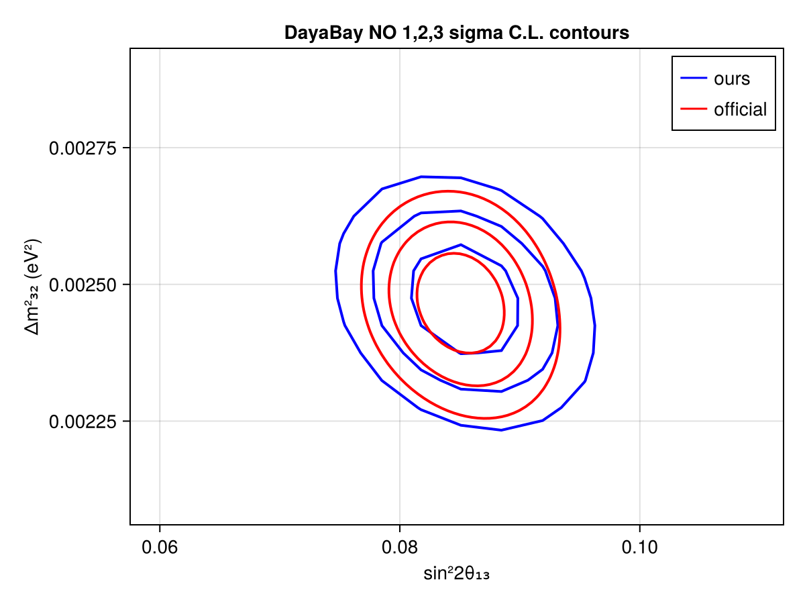
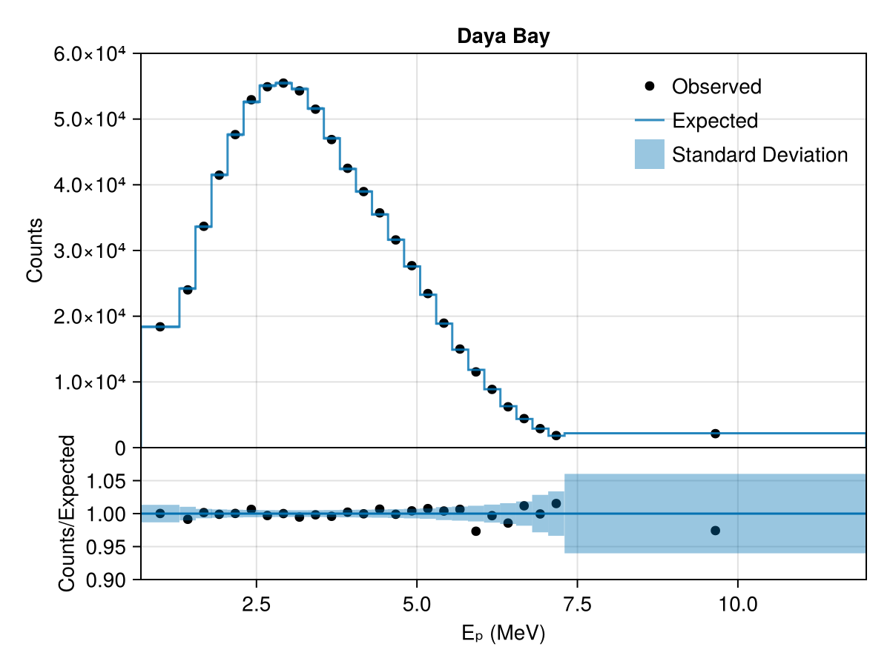

# DayaBay
 ## Resources
Data from supplemental files on https://arxiv.org/abs/2211.14988

## Test output plots

## Meta Information
- **repo_clean**: false
- **exec_time**: 2.4554059505462646
- **username**: peller
- **repo**: /mnt/c/Users/peller/work/Newtrinos
- **hostname**: flippy
- **params**: (Δm²₂₁ = 7.53e-5, Δm²₃₁ = 0.0024752999999999997, δCP = 1.0, θ₁₂ = 0.5872523687443223, θ₁₃ = 0.1454258194533693, θ₂₃ = 0.8556288707523761)
- **date**: 2025-10-07 09:47:05
- **task**: scan
- **vars_to_scan**: OrderedDict{Any, Any}(:θ₁₃ => 11, :Δm²₃₁ => 11)
- **commit_hash**: 8b13ff2b23b385c04339621e438628ecd2bba30f
- **priors**: (Δm²₂₁ = 7.53e-5, Δm²₃₁ = Uniform{Float64}(a=0.0023, b=0.0028), δCP = 1.0, θ₁₂ = 0.5872523687443223, θ₁₃ = Uniform{Float64}(a=0.13, b=0.16), θ₂₃ = 0.8556288707523761)
