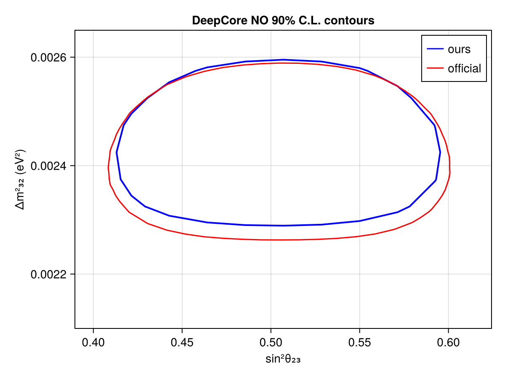
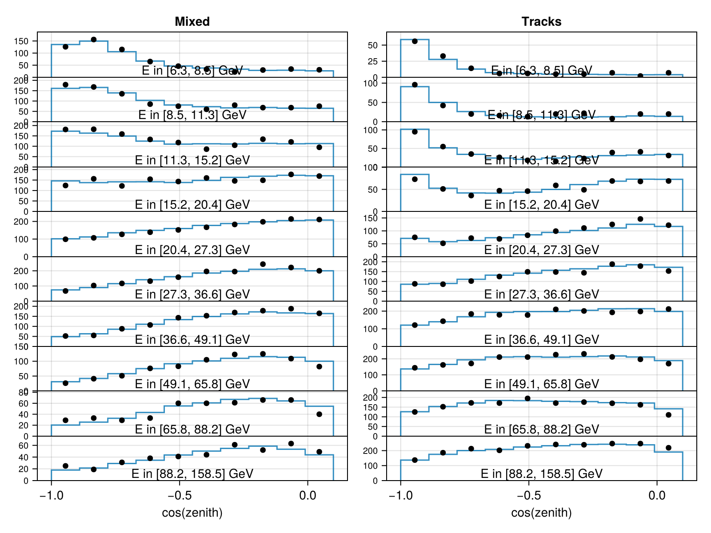

# IceCube DeepCore 9y Verification Sample
 ## Resources
data source: https://icecube.wisc.edu/data-releases/2025/07/measurement-of-atmospheric-neutrino-mixing-with-improved-icecube-deepcore-calibration-and-data-processing/
IceCube Collaboration, 2025, "Replication Data for: Measurement of atmospheric neutrino mixing with improved IceCube DeepCore calibration and data processing", https://doi.org/10.7910/DVN/B4RITM, Harvard Dataverse, V1, UNF:6:EqPPIAlmbhWU7MUgQgQVCw== [fileUNF]
        

## Test output plots

## Meta Information
- **repo_clean**: false
- **exec_time**: 1816.6649839878082
- **username**: peller
- **repo**: /mnt/c/Users/peller/work/Newtrinos
- **cache_dir**: test
- **hostname**: flippy
- **params**: (atm_flux_delta_spectral_index = 0.0, atm_flux_nuenumu_sigma = 0.0, atm_flux_nunubar_sigma = 0.0, atm_flux_uphorizonzal_sigma = 0.0, deepcore_aeff_scale = 1.0, deepcore_atm_muon_scale = 1.0, deepcore_ice_absorption = 1.0, deepcore_ice_scattering = 1.0, deepcore_opt_eff_overall = 1.0, deepcore_rel_eff_p0 = 0.1, deepcore_rel_eff_p1 = -0.05, nc_norm = 1.0, nutau_cc_norm = 1.0, Δm²₂₁ = 7.53e-5, Δm²₃₁ = 0.0024752999999999997, δCP = 1.0, θ₁₂ = 0.5872523687443223, θ₁₃ = 0.1454258194533693, θ₂₃ = 0.8556288707523761)
- **date**: 2025-10-08 09:44:41
- **task**: profile
- **vars_to_scan**: OrderedDict{Any, Any}(:θ₂₃ => 11, :Δm²₃₁ => 11)
- **commit_hash**: 8aec97a5393edf1fac6a1c6408ba7dbab72b4960
- **priors**: (atm_flux_delta_spectral_index = Truncated(Normal{Float64}(μ=0.0, σ=0.1); lower=-0.3, upper=0.3), atm_flux_nuenumu_sigma = Truncated(Normal{Float64}(μ=0.0, σ=1.0); lower=-3.0, upper=3.0), atm_flux_nunubar_sigma = Truncated(Normal{Float64}(μ=0.0, σ=1.0); lower=-3.0, upper=3.0), atm_flux_uphorizonzal_sigma = Truncated(Normal{Float64}(μ=0.0, σ=1.0); lower=-3.0, upper=3.0), deepcore_aeff_scale = Uniform{Float64}(a=0.5, b=2.0), deepcore_atm_muon_scale = Uniform{Float64}(a=0.0, b=2.0), deepcore_ice_absorption = Uniform{Float64}(a=0.8, b=1.2), deepcore_ice_scattering = Uniform{Float64}(a=0.8, b=1.2), deepcore_opt_eff_overall = Truncated(Normal{Float64}(μ=1.0, σ=0.1); lower=0.8, upper=1.2), deepcore_rel_eff_p0 = Uniform{Float64}(a=-1.0, b=0.5), deepcore_rel_eff_p1 = Uniform{Float64}(a=-0.15, b=0.05), nc_norm = Truncated(Normal{Float64}(μ=1.0, σ=0.2); lower=0.4, upper=1.6), nutau_cc_norm = 1.0, Δm²₂₁ = 7.53e-5, Δm²₃₁ = Uniform{Float64}(a=0.0022, b=0.0027), δCP = 1.0, θ₁₂ = 0.5872523687443223, θ₁₃ = Truncated(Normal{Float64}(μ=0.156, σ=0.008); lower=0.13, upper=0.18), θ₂₃ = Uniform{Float64}(a=0.685, b=0.9))
