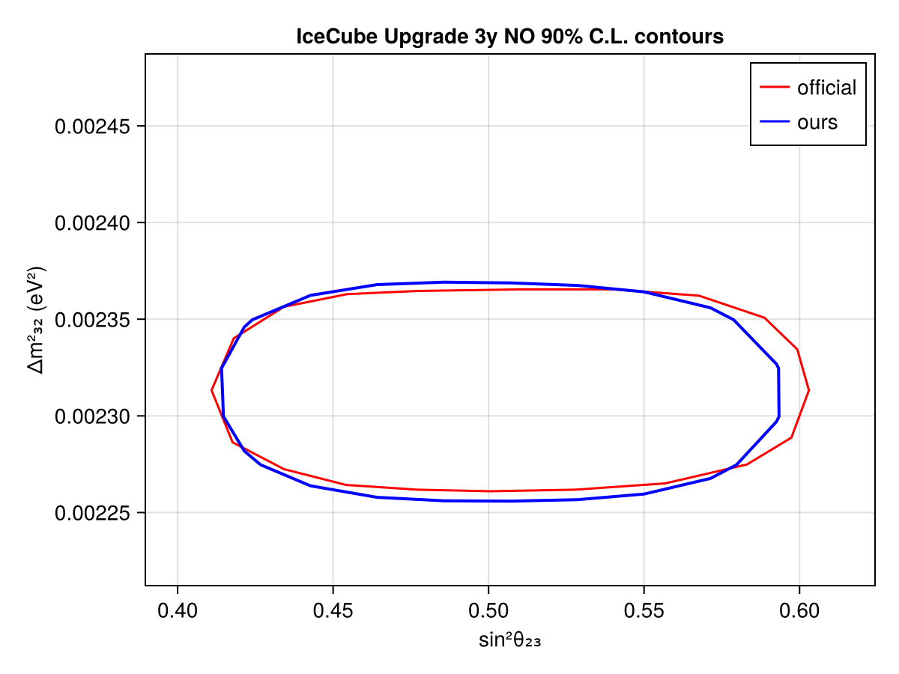
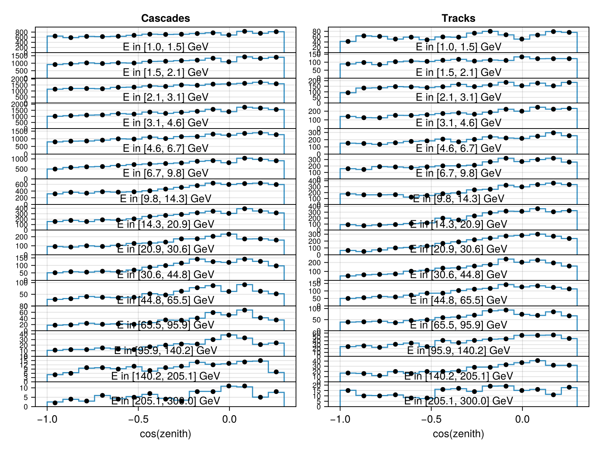

# IceCube Upgrade 3y MC Sample
 ## Resources
data source: https://icecube.wisc.edu/data-releases/2020/04/icecube-upgrade-neutrino-monte-carlo-simulation/
## Test output plots

## Meta Information
- **repo_clean**: false
- **exec_time**: 11.654697895050049
- **username**: peller
- **repo**: /mnt/c/Users/peller/work/Newtrinos
- **cache_dir**: test
- **hostname**: flippy
- **params**: (atm_flux_delta_spectral_index = 0.0, atm_flux_nuenumu_sigma = 0.0, atm_flux_nunubar_sigma = 0.0, atm_flux_uphorizonzal_sigma = 0.0, ic_upgrade_energy_scale = 1.0, ic_upgrade_lifetime = 3.0, nc_norm = 1.0, nutau_cc_norm = 1.0, Δm²₂₁ = 7.53e-5, Δm²₃₁ = 0.0023853, δCP = 1.0, θ₁₂ = 0.5872523687443223, θ₁₃ = 0.1454258194533693, θ₂₃ = 0.7953988301841435)
- **date**: 2025-10-08 16:27:04
- **task**: profile
- **vars_to_scan**: OrderedDict{Any, Any}(:θ₂₃ => 11, :Δm²₃₁ => 11)
- **commit_hash**: d1afda6281372d8e4e2eb3e6a4210f7a81bfdff9
- **priors**: (atm_flux_delta_spectral_index = Truncated(Normal{Float64}(μ=0.0, σ=0.1); lower=-0.3, upper=0.3), atm_flux_nuenumu_sigma = Truncated(Normal{Float64}(μ=0.0, σ=1.0); lower=-3.0, upper=3.0), atm_flux_nunubar_sigma = Truncated(Normal{Float64}(μ=0.0, σ=1.0); lower=-3.0, upper=3.0), atm_flux_uphorizonzal_sigma = Truncated(Normal{Float64}(μ=0.0, σ=1.0); lower=-3.0, upper=3.0), ic_upgrade_energy_scale = Truncated(Normal{Float64}(μ=1.0, σ=0.1); lower=0.8, upper=1.2), ic_upgrade_lifetime = Uniform{Float64}(a=2.0, b=4.0), nc_norm = Truncated(Normal{Float64}(μ=1.0, σ=0.2); lower=0.4, upper=1.6), nutau_cc_norm = 1.0, Δm²₂₁ = 7.53e-5, Δm²₃₁ = Uniform{Float64}(a=0.0023, b=0.00255), δCP = 1.0, θ₁₂ = 0.5872523687443223, θ₁₃ = Truncated(Normal{Float64}(μ=0.156, σ=0.008); lower=0.13, upper=0.18), θ₂₃ = Uniform{Float64}(a=0.685, b=0.9))
