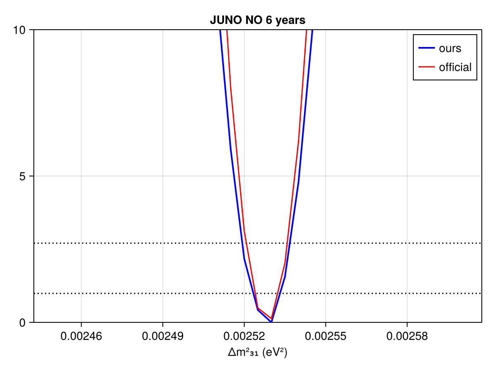
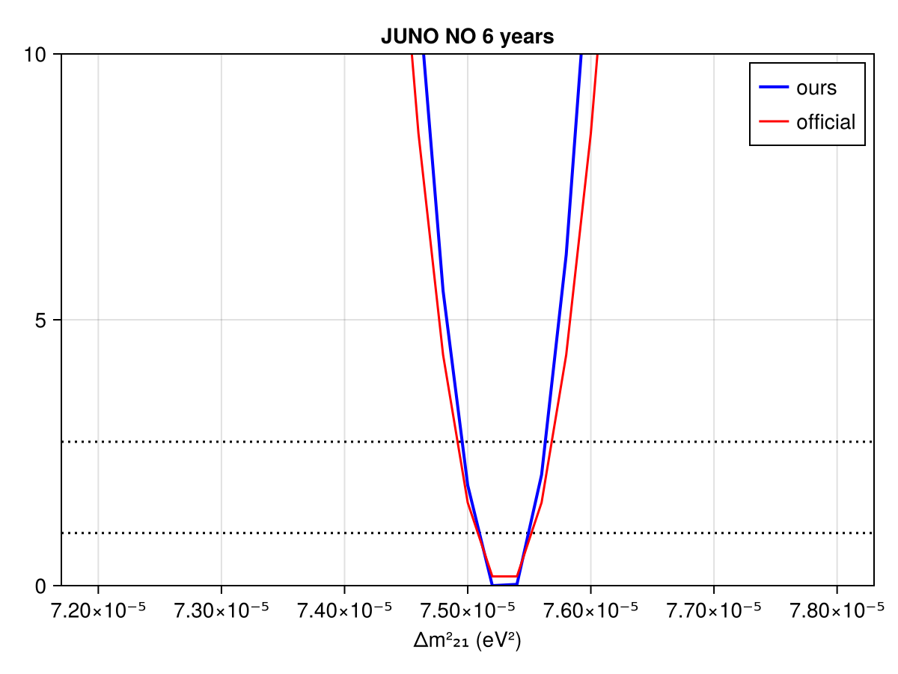
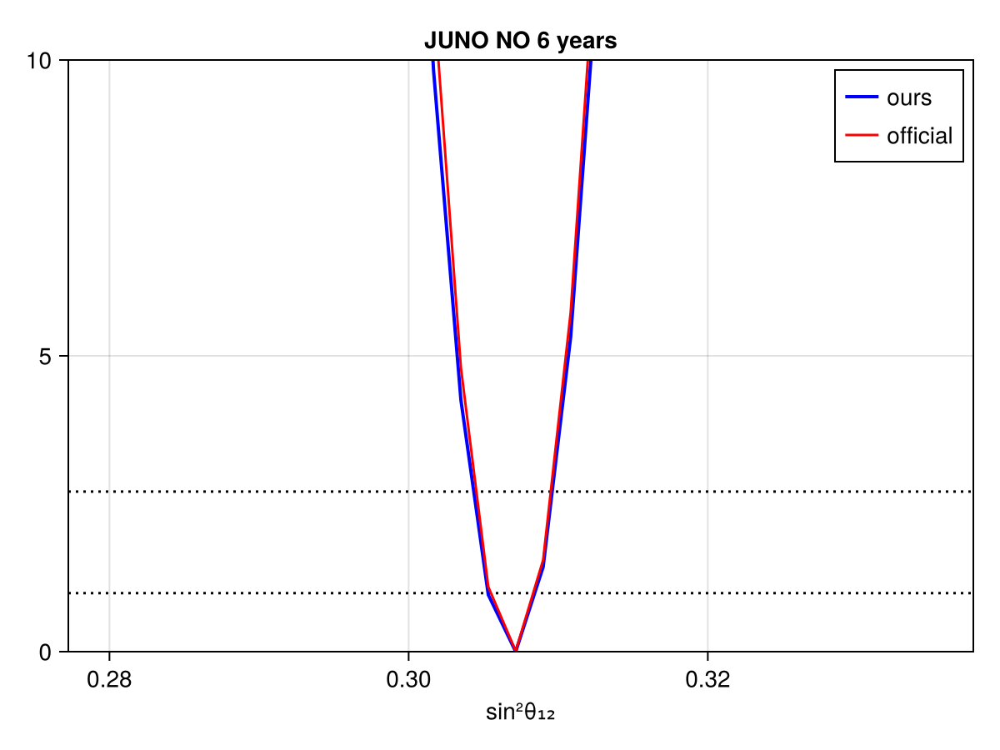
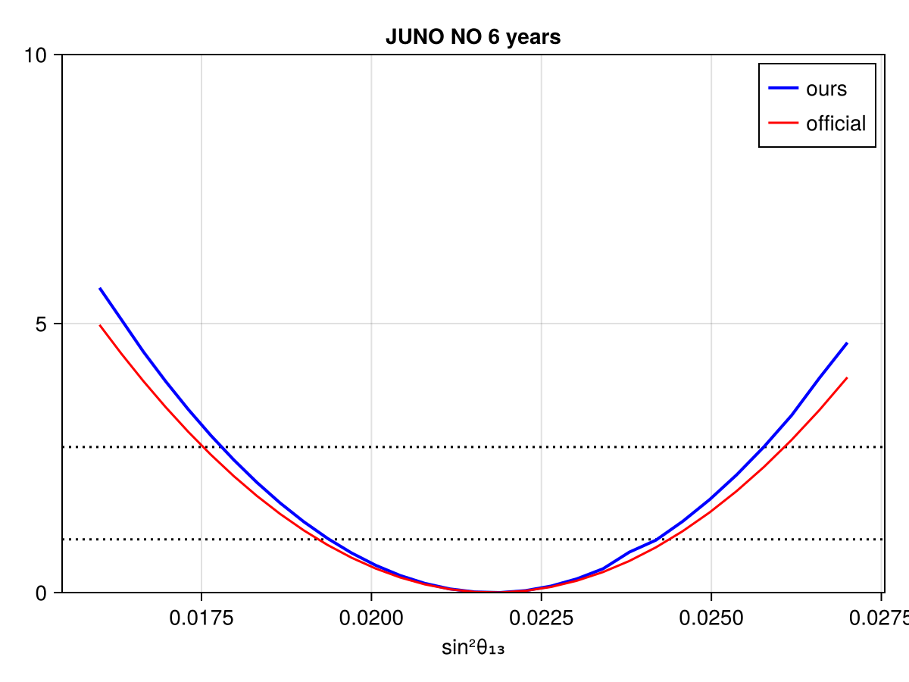

# JUNO
 ## Resources
Data source: -

## Test output plots

## Meta Information
- **repo_clean**: false
- **exec_time**: 1.3059837818145752
- **username**: peller
- **repo**: /mnt/c/Users/peller/work/Newtrinos
- **cache_dir**: test_theta13
- **hostname**: flippy
- **params**: (juno_accidental_norm = 1.0, juno_atmnc_norm = 1.0, juno_co_norm = 1.0, juno_detection_epsilon = 1.0, juno_fast_neutron_norm = 1.0, juno_geo_rate_norm = 1.0, juno_geo_shape_eps = 0.0, juno_lihe_norm = 1.0, juno_res_a = 0.0261, juno_res_b = 0.0082, juno_res_c = 0.0123, juno_world_reactor_norm = 1.0, junotao_energy_scale = 1.0, junotao_flux_scale = 1.0, junotao_shape_eps = 0.0, Δm²₂₁ = 7.53e-5, Δm²₃₁ = 0.0025283, δCP = 0, θ₁₂ = 0.5872523687443223, θ₁₃ = 0.14819001778459273, θ₂₃ = 0.8556288707523761)
- **date**: 2025-10-07 17:30:20
- **task**: profile
- **vars_to_scan**: OrderedDict{Any, Any}(:θ₁₃ => 31)
- **commit_hash**: 4a4f6f0f9c9e2eff3d1348613a2afc2d9723998f
- **priors**: (juno_accidental_norm = Truncated(Normal{Float64}(μ=1.0, σ=0.01); lower=0.0, upper=Inf), juno_atmnc_norm = Truncated(Normal{Float64}(μ=1.0, σ=0.5); lower=0.0, upper=Inf), juno_co_norm = Truncated(Normal{Float64}(μ=1.0, σ=0.5); lower=0.0, upper=Inf), juno_detection_epsilon = Truncated(Normal{Float64}(μ=1.0, σ=0.01); lower=0.0, upper=Inf), juno_fast_neutron_norm = Truncated(Normal{Float64}(μ=1.0, σ=1.0); lower=0.0, upper=Inf), juno_geo_rate_norm = Truncated(Normal{Float64}(μ=1.0, σ=0.3); lower=0.0, upper=Inf), juno_geo_shape_eps = Normal{Float64}(μ=0.0, σ=1.0), juno_lihe_norm = Truncated(Normal{Float64}(μ=1.0, σ=0.2); lower=0.0, upper=Inf), juno_res_a = Truncated(Normal{Float64}(μ=0.0261, σ=0.0002); lower=0.0, upper=Inf), juno_res_b = Truncated(Normal{Float64}(μ=0.0082, σ=0.0001); lower=0.0, upper=Inf), juno_res_c = Truncated(Normal{Float64}(μ=0.0123, σ=0.0004); lower=0.0, upper=Inf), juno_world_reactor_norm = Truncated(Normal{Float64}(μ=1.0, σ=0.02); lower=0.0, upper=Inf), junotao_energy_scale = Truncated(Normal{Float64}(μ=1.0, σ=0.005); lower=0.0, upper=Inf), junotao_flux_scale = Truncated(Normal{Float64}(μ=1.0, σ=0.02); lower=0.0, upper=Inf), junotao_shape_eps = Normal{Float64}(μ=0.0, σ=1.0), Δm²₂₁ = Uniform{Float64}(a=7.2e-5, b=7.8e-5), Δm²₃₁ = Uniform{Float64}(a=0.00245, b=0.0026), δCP = Uniform{Float64}(a=0.0, b=6.283185307179586), θ₁₂ = Uniform{Float64}(a=0.5575988266995366, b=0.6172463758204582), θ₁₃ = Uniform{Float64}(a=0.1268308680377276, b=0.16506532381642566), θ₂₃ = 0.8556288707523761)
