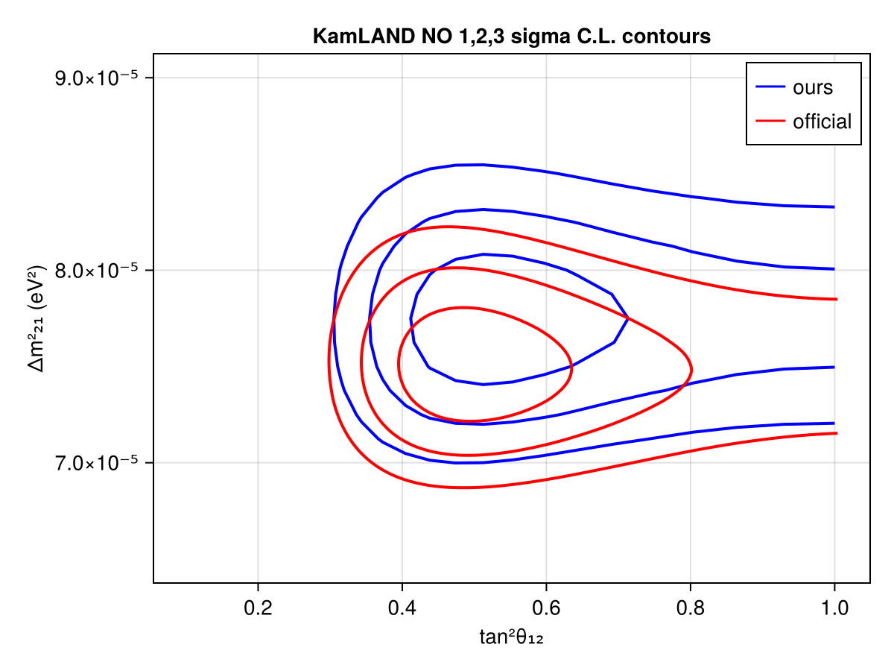
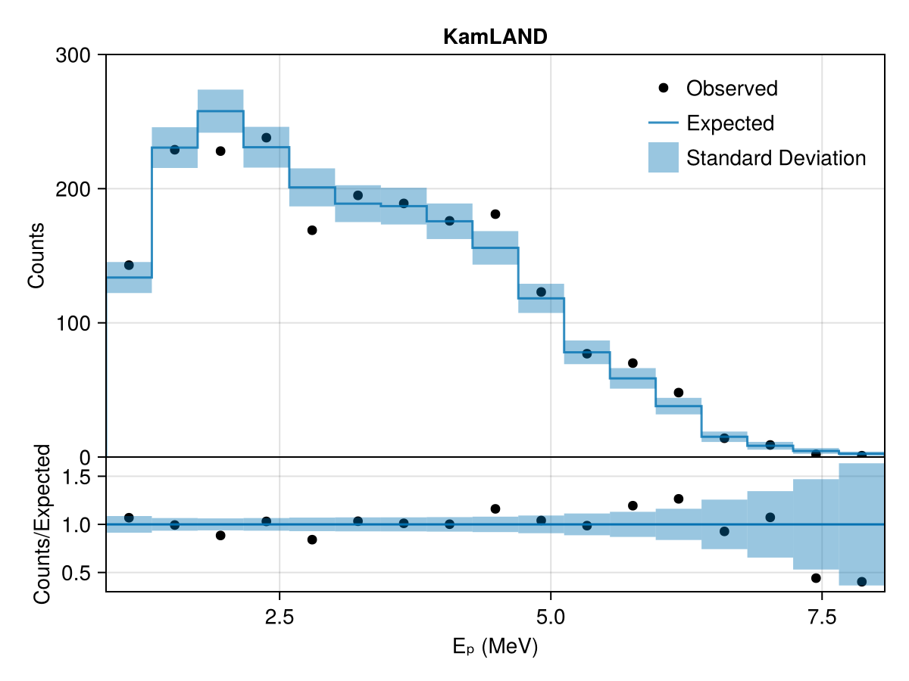

# KamLAND
 ## Resources
Data digitized from plots in https://arxiv.org/abs/1009.4771

## Test output plots

## Meta Information
- **repo_clean**: false
- **exec_time**: 23.88645601272583
- **username**: peller
- **repo**: /mnt/c/Users/peller/work/Newtrinos
- **cache_dir**: test
- **hostname**: flippy
- **params**: (kamland_energy_scale = 0.0, kamland_flux_scale = 0.0, kamland_geonu_scale = 0.0, Δm²₂₁ = 7.53e-5, Δm²₃₁ = 0.0024752999999999997, δCP = 1.0, θ₁₂ = 0.5872523687443223, θ₁₃ = 0.0, θ₂₃ = 0.8556288707523761)
- **date**: 2025-10-08 13:29:34
- **task**: profile
- **vars_to_scan**: OrderedDict{Any, Any}(:θ₁₂ => 21, :Δm²₂₁ => 21)
- **commit_hash**: d683d878435398a273b5da4942412c3d84ece5a7
- **priors**: (kamland_energy_scale = Truncated(Normal{Float64}(μ=0.0, σ=1.0); lower=-3.0, upper=3.0), kamland_flux_scale = Truncated(Normal{Float64}(μ=0.0, σ=1.0); lower=-3.0, upper=3.0), kamland_geonu_scale = Uniform{Float64}(a=-0.5, b=0.5), Δm²₂₁ = Uniform{Float64}(a=6.5e-5, b=9.0e-5), Δm²₃₁ = 0.0024752999999999997, δCP = 1.0, θ₁₂ = Uniform{Float64}(a=0.4205343352839651, b=0.7853981633974483), θ₁₃ = 0.0, θ₂₃ = 0.8556288707523761)
