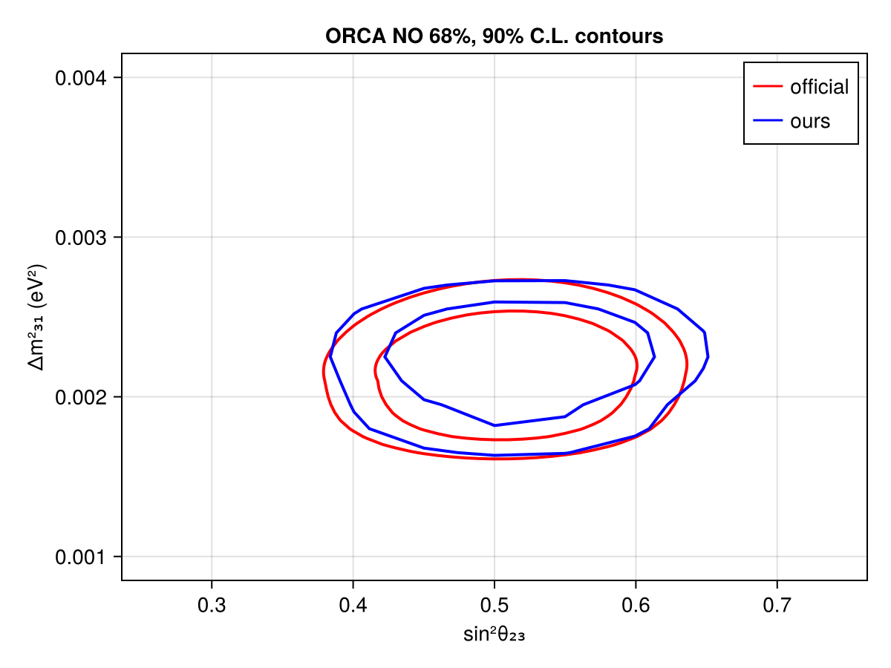
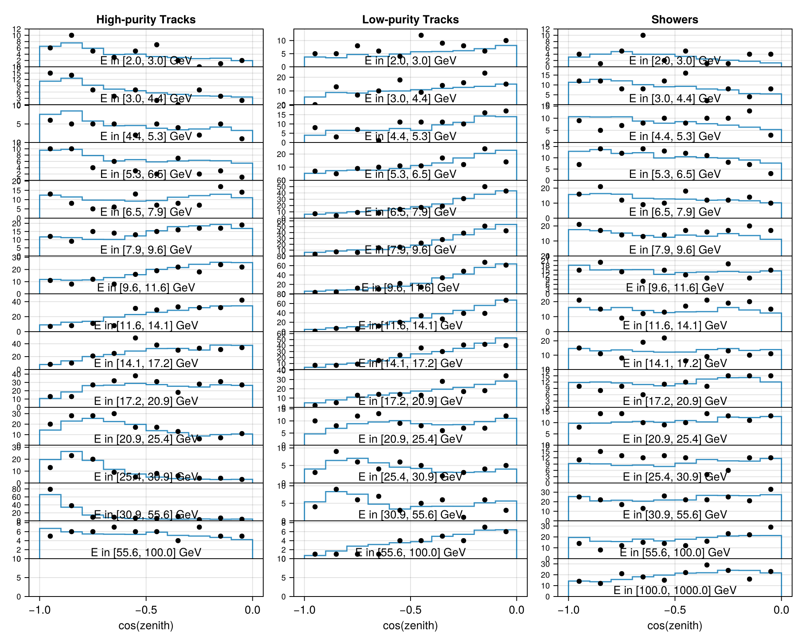

# KM3NeT ORCA6 433 k-ton Sample
 ## Resources
Data source: https://opendata.km3net.de/dataset.xhtml?persistentId=doi:10.5072/FK2/Y0UXVW

## Test output plots

## Meta Information
- **repo_clean**: false
- **exec_time**: 14.9253249168396
- **username**: peller
- **repo**: /mnt/c/Users/peller/work/Newtrinos
- **cache_dir**: test
- **hostname**: flippy
- **params**: (atm_flux_delta_spectral_index = 0.0, atm_flux_nuenumu_sigma = 0.0, atm_flux_nunubar_sigma = 0.0, atm_flux_uphorizonzal_sigma = 0.0, nc_norm = 1.0, nutau_cc_norm = 1.0, orca_energy_scale = 1.0, orca_norm_all = 1.0, orca_norm_he = 1.0, orca_norm_hpt = 1.0, orca_norm_muons = 1.0, orca_norm_showers = 1.0, Δm²₂₁ = 7.53e-5, Δm²₃₁ = 0.0024752999999999997, δCP = 1.0, θ₁₂ = 0.5872523687443223, θ₁₃ = 0.1454258194533693, θ₂₃ = 0.8556288707523761)
- **date**: 2025-10-07 15:36:16
- **task**: profile
- **vars_to_scan**: OrderedDict{Any, Any}(:θ₂₃ => 11, :Δm²₃₁ => 11)
- **commit_hash**: f4e7cc16097a1637b8d7a8658eaf5ba49299adba
- **priors**: (atm_flux_delta_spectral_index = Truncated(Normal{Float64}(μ=0.0, σ=0.1); lower=-0.3, upper=0.3), atm_flux_nuenumu_sigma = Truncated(Normal{Float64}(μ=0.0, σ=1.0); lower=-3.0, upper=3.0), atm_flux_nunubar_sigma = Truncated(Normal{Float64}(μ=0.0, σ=1.0); lower=-3.0, upper=3.0), atm_flux_uphorizonzal_sigma = Truncated(Normal{Float64}(μ=0.0, σ=1.0); lower=-3.0, upper=3.0), nc_norm = Truncated(Normal{Float64}(μ=1.0, σ=0.2); lower=0.4, upper=1.6), nutau_cc_norm = Truncated(Normal{Float64}(μ=1.0, σ=0.2); lower=0.4, upper=1.6), orca_energy_scale = Truncated(Normal{Float64}(μ=1.0, σ=0.09); lower=0.7, upper=1.3), orca_norm_all = Uniform{Float64}(a=0.5, b=1.5), orca_norm_he = Truncated(Normal{Float64}(μ=1.0, σ=0.5); lower=0.0, upper=3.0), orca_norm_hpt = Uniform{Float64}(a=0.5, b=1.5), orca_norm_muons = Uniform{Float64}(a=0.0, b=2.0), orca_norm_showers = Uniform{Float64}(a=0.5, b=1.5), Δm²₂₁ = 7.53e-5, Δm²₃₁ = Uniform{Float64}(a=0.0015, b=0.003), δCP = 1.0, θ₁₂ = 0.5872523687443223, θ₁₃ = Truncated(Normal{Float64}(μ=0.156, σ=0.008); lower=0.13, upper=0.18), θ₂₃ = Uniform{Float64}(a=0.5353981633974483, b=1.0353981633974483))
