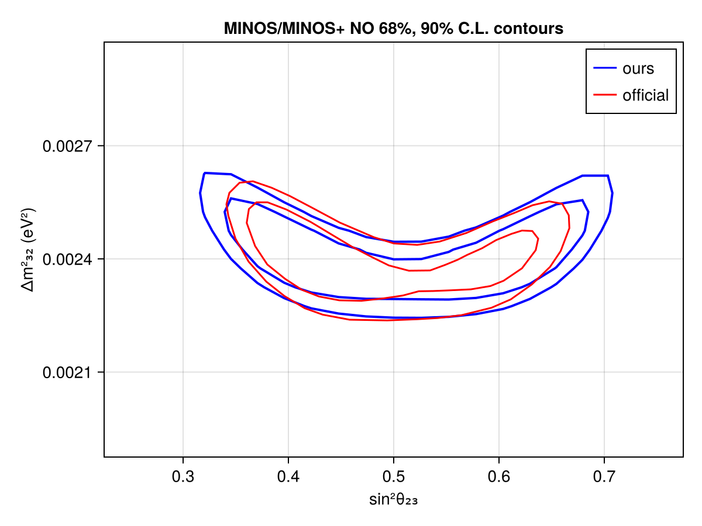
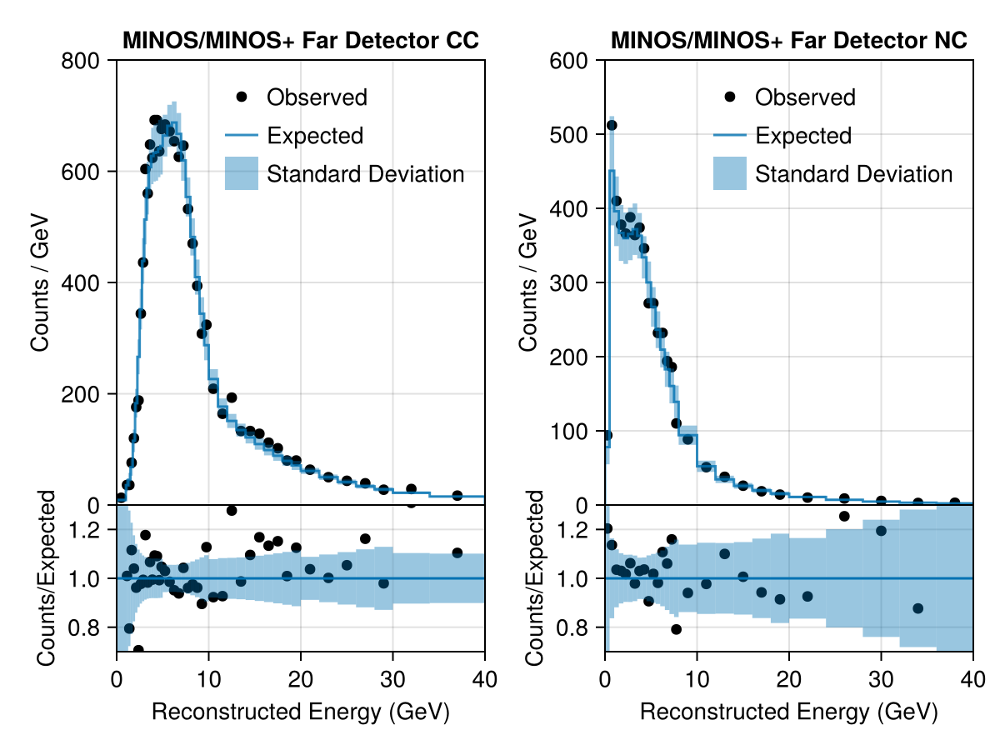

# MINOS
 ## Resources
Data from supplemental files in https://arxiv.org/abs/1710.06488

## Test output plots

## Meta Information
- **repo_clean**: false
- **exec_time**: 29.882673978805542
- **username**: peller
- **repo**: /mnt/c/Users/peller/work/Newtrinos
- **cache_dir**: test
- **hostname**: flippy
- **params**: (nc_norm = 1.0, nutau_cc_norm = 1.0, Δm²₂₁ = 7.53e-5, Δm²₃₁ = 0.0024752999999999997, δCP = 1.0, θ₁₂ = 0.5872523687443223, θ₁₃ = 0.1454258194533693, θ₂₃ = 0.8556288707523761)
- **date**: 2025-10-07 11:46:00
- **task**: profile
- **vars_to_scan**: OrderedDict{Any, Any}(:θ₂₃ => 21, :Δm²₃₁ => 21)
- **commit_hash**: a308b8d7d4e22123eb765d714f43adb63de6b1a9
- **priors**: (nc_norm = 1.0, nutau_cc_norm = Truncated(Normal{Float64}(μ=1.0, σ=0.2); lower=0.4, upper=1.6), Δm²₂₁ = 7.53e-5, Δm²₃₁ = Uniform{Float64}(a=0.002, b=0.003), δCP = 1.0, θ₁₂ = 0.5872523687443223, θ₁₃ = Truncated(Normal{Float64}(μ=0.156, σ=0.008); lower=0.13, upper=0.18), θ₂₃ = Uniform{Float64}(a=0.5235987755982988, b=1.0471975511965976))
